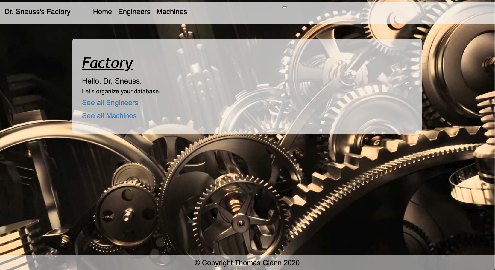
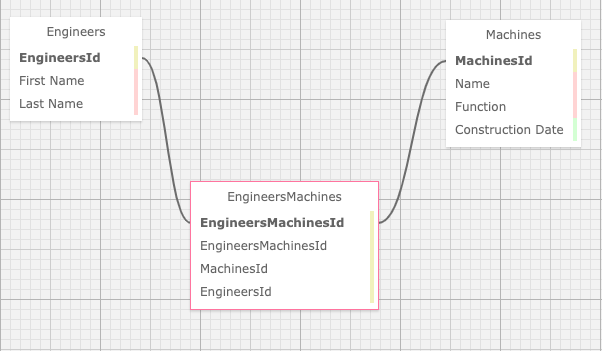

# _Factory_

#### _C#/.NET Project for [Epicodus](https://www.epicodus.com/), 2020.08.07_

#### By **Thomas Glenn**

## Description
A code review program for Epicodus school, which tracks the Engineers for Dr. Sneuss, the owner of his Factory. This project demonstrates many-to-many database relationships. 



The following sitemap explains this database query relationship between "Engineers" and the "Machines" they are authorized to repair.

## Database Structure


## Specifications

| Spec | Input | Output | 
|:--------- |:--------- |:-------- |
| The program will construct a database of Engineers allowing Dr. Sneuss to make entries | "First Name", "Last Name "ID" | "Tony Stark" "1"| 
| The program will construct a database of Machines allowing Dr. Sneuss to make entries | "Name"  "Function" "Contruction Date" | "Robbie2369*" "Protocol Droid" "08.07.2020"|
| The program will allow Dr. Sneuss to view lists of Engineers | "View Engineers List" | "Tony Stark" -- "Caractacus Potts"|
| The program will allow Dr. Sneuss to view lists of Machines |  "View List of Machines" | "Iron Man -- Chitty Chitty Bang Bang" |
| The program will allow Dr. Sneuss to view lists of Machines with the Engineers licensed to repair them | "View Machines under this Engineer" | "Tony Stark -- Iron Man" |
| The program will allow Dr. Sneuss to view lists of Engineers with the Machines they are licensed to repair| "View Engineers associated with this Machine" | "Iron Man -- Tony Stark" |
| The program will allow Dr. Sneuss to edit entries | "Tony Stank" | "Tony Stark" |
| The program will allow Dr. Sneuss to delete entries | "Tony Stark" | " " | 

## Known Bugs
* No known bugs.   

## Setup/Installation Requirements
#### View Online
Visit the GitHub Pages by clicking on the following link or by typing it in your web browser. 
<url:>

https://github.com/thomasglenngit/Factory.Solution

#### View locally

*[.NET Core](https://dotnet.microsoft.com/download/dotnet-core/2.2) is needed to run this application*

To clone this repository from your command line you will need [Git](https://git-scm.com/) installed. 

First navigate in the command line to where you want to clone this repository. 

Then from your command line run:

`$ git clone `

Once the repository has been cloned, navigate to the to the application directory and run `$ dotnet restore`.
Once 'restore' is run, enter `$ dotnet build`.

#### MySQL Setup
In order to view and use the functionality of this project you must,
1. Install MySQL on your computer. If you don't have it, you can download the .dmg file here:
https://dev.mysql.com/downloads/file/?id=484914. You'll need to create a password.

2. Install MySQL Workbench on your computer. If you don't have it, you can download it here:
https://dev.mysql.com/downloads/file/?id=484391.

3. Open MySQL Workbench and select the Local instance 3306 server. 

#### Importing this file:
1. Open your MySQL Workbench. In the Navigator > Administration window, select Data Import/Restore.

2. In Import Options select Import from Self-Contained File.

3. Navigate to `thomas_glenn`.

Under Default Schema to be Imported To, select the New button.

Enter the name of your database with _test appended to the end.
In this case thomas_glenn_test.
Click Ok.
Click Start Import.

Reopen the Navigator > Schemas tab. Right click and select Refresh All. Our new test database will appear.

#### Query
The following is the query information for access this database on MySQL Workbench.
```
  CREATE DATABASE `factory` /*!40100 DEFAULT CHARACTER SET utf8mb4 COLLATE utf8mb4_0900_ai_ci */;
CREATE TABLE `__EFMigrationsHistory` (
  `MigrationId` varchar(95) NOT NULL,
  `ProductVersion` varchar(32) NOT NULL,
  PRIMARY KEY (`MigrationId`)
) ENGINE=InnoDB DEFAULT CHARSET=utf8mb4 COLLATE=utf8mb4_0900_ai_ci;
CREATE TABLE `EngineerMachine` (
  `EngineerMachineId` int(11) NOT NULL AUTO_INCREMENT,
  `MachineId` int(11) NOT NULL,
  `EngineerId` int(11) NOT NULL,
  PRIMARY KEY (`EngineerMachineId`),
  KEY `IX_EngineerMachine_EngineerId` (`EngineerId`),
  KEY `IX_EngineerMachine_MachineId` (`MachineId`),
  CONSTRAINT `FK_EngineerMachine_Engineers_EngineerId` FOREIGN KEY (`EngineerId`) REFERENCES `engineers` (`EngineerId`) ON DELETE CASCADE,
  CONSTRAINT `FK_EngineerMachine_Machines_MachineId` FOREIGN KEY (`MachineId`) REFERENCES `machines` (`MachineId`) ON DELETE CASCADE
) ENGINE=InnoDB DEFAULT CHARSET=utf8mb4 COLLATE=utf8mb4_0900_ai_ci;
CREATE TABLE `Engineers` (
  `EngineerId` int(11) NOT NULL AUTO_INCREMENT,
  `FirstName` longtext,
  `LastName` longtext,
  PRIMARY KEY (`EngineerId`)
) ENGINE=InnoDB DEFAULT CHARSET=utf8mb4 COLLATE=utf8mb4_0900_ai_ci;
CREATE TABLE `Machines` (
  `MachineId` int(11) NOT NULL AUTO_INCREMENT,
  `Name` longtext,
  `Function` longtext,
  `ConstructionDate` datetime(6) NOT NULL,
  PRIMARY KEY (`MachineId`)
) ENGINE=InnoDB DEFAULT CHARSET=utf8mb4 COLLATE=utf8mb4_0900_ai_ci;

```
#### Entity
Entity is a framework which coordinates the properties associated with the project models, and the corresponding datatables stored in MySQL. In order to keep the database refreshed with user inputs and possible changes to the application models, the following commands must be made after these inputs and changes:

1. In the terminal command line, enter: `dotnet ef migration add (name of migration)`. You can name the migration what you will, but remember that each new migration must have a unique name. Best practices are to name the first migration, "Initial", then "Secondary", etc. Also note that the first letter of the migration name should always be capitalized. If all goes well, the terminal will respond with the affirmation, "Done."

2. Following the migration the database must be updated with the following command: `dotnet ef database update`. Again, if all goes well, after entering this command, the terminal will affirm the update and migration by displaying the migration with a unique migration number and the affirmation, "Done".

3. Check to see that the migration appears in MySQl Workbench, as well as newly formed "Migrations" folder in your VSCode editor.

### Edit
* To view and edit the code, open the application in your preferred code editor, such as Visual Studio Code.

## Technologies Used
* Visual Studio Code (code editor)
* C#/.NET
* GitHub
* MSTests
* MacOS Catalina
* MySQL Workbench
* CSS
* .html

## License
This software is licensed under the MIT license. Copyright (c) 2020 Thomas Glenn.

